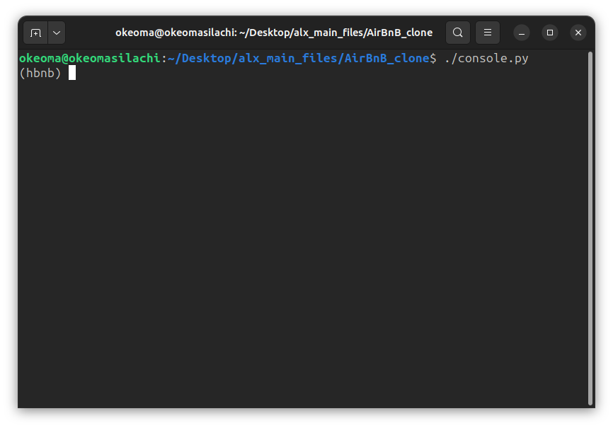
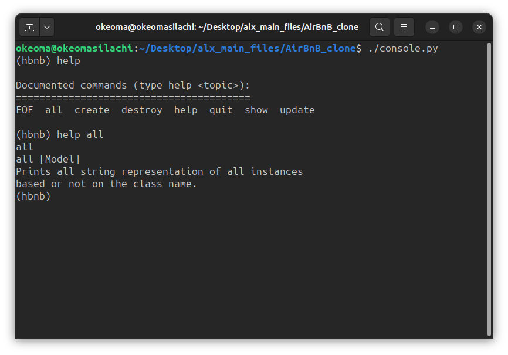
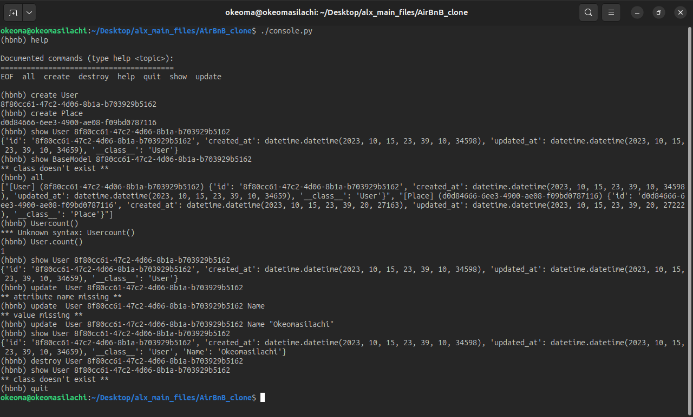

# AirBnB_Clone Project
## Command Interpreter

The command interpreter is a tool that allows users to interact with the application through a command-line interface. It provides functionalities to manage instances of various classes.

### Starting the Command Interpreter

To start the command interpreter, run the following command:
```Bash
$ ./console.py
```


How to Use the Command Interpreter
Once the command interpreter is running, you can use the following commands:

`quit or EOF`:
Exits the program. 

`help`: Displays the list of available commands and their descriptions.


#### Available Commands
`create <class_name>`: Creates a new instance of the specified class, saves it to the JSON file, and prints its unique ID.

***Example***:
```Bash
(hbnb) create BaseModel
```

<br>

`show <class_name> <id>`: Prints the string representation of an instance based on the class name and ID.

***Example***:
```Bash
(hbnb) show BaseModel 1234-1234-1234
```

<br>
`destroy <class_name> <id>`: Deletes an instance based on the class name and ID, and saves the change to the JSON file.

Example: $ destroy BaseModel 1234-1234-1234
all [class_name]: Prints all string representations of instances of the specified class. If no class name is provided, it prints all instances of all classes.

Example: 
```Bash
$ all BaseModel
<class_name>.all(): Retrieves all instances of the specified class.

<class_name>.count(): Retrieves the number of instances of the specified class.

<class_name>.show(<id>): Retrieves an instance based on its ID.

<class_name>.destroy(<id>): Destroys an instance based on its ID.

<class_name>.update(<id>, <attribute_name>, <attribute_value>): Updates an instance by adding or updating an attribute.

<class_name>.update(<id>, <dictionary_representation>): Updates an instance using a dictionary representation.

Examples
Here are some examples of how to use the command interpreter:

Creating an instance of BaseModel:

$ create BaseModel
Showing an instance:

$ show BaseModel 1234-1234-1234
Destroying an instance:

$ destroy BaseModel 1234-1234-1234
Retrieving all instances of BaseModel:

$ BaseModel.all()
Retrieving the number of instances of BaseModel:

$ BaseModel.count()
Retrieving an instance by ID:

$ BaseModel.show(1234-1234-1234)
Destroying an instance by ID:

$ BaseModel.destroy(1234-1234-1234)
Updating an instance using attribute name and value:

$ update BaseModel 1234-1234-1234 email "aibnb@mail.com"


Updating an instance using a dictionary representation:

```Bash
$ update BaseModel 1234-1234-1234 {'email': 'aibnb@mail.com', 'first_name': 'John'}
```
<br>

### File Storage
The File Storage class handles the serialization and deserialization of instances to and from a JSON file. It manages instances of the following classes: BaseModel, Place, State, City, Amenity, and Review.



Usage
To use the application, follow these steps:

Clone the repository.
Run the command interpreter using ./console.py.
Use the available commands to interact with the application.
Dependencies
Python (>=3.8)
